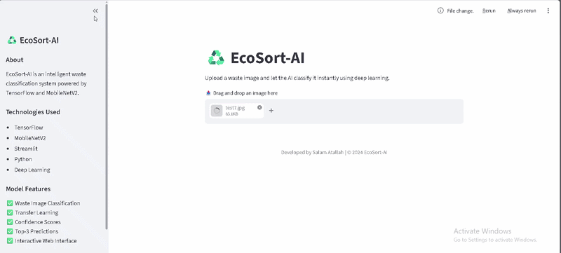
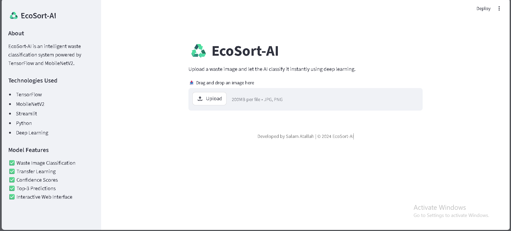
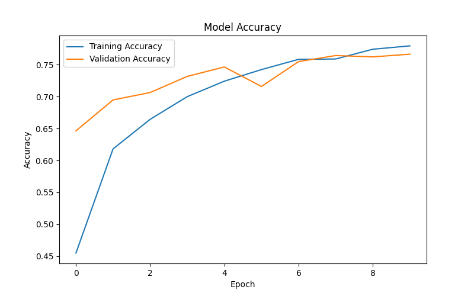
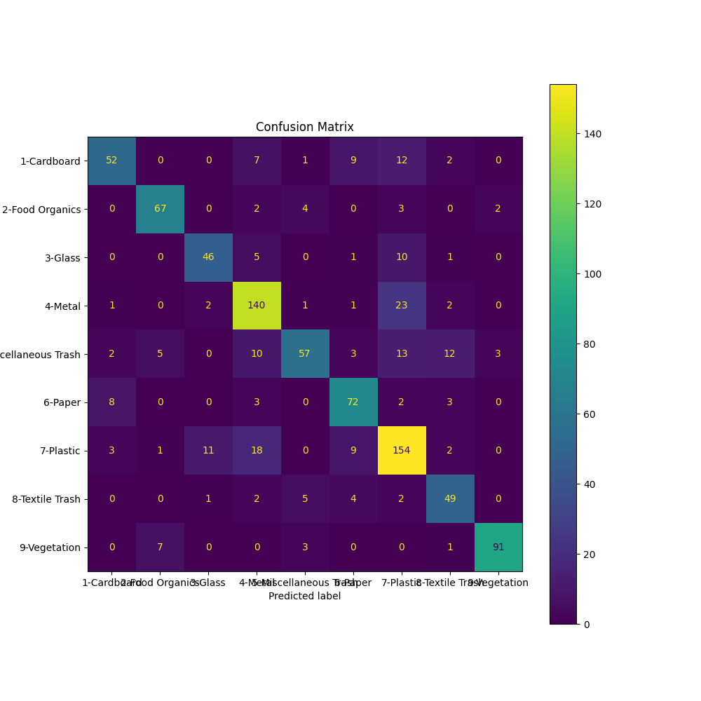

# ♻️ EcoSort-AI

An intelligent waste classification system powered by *TensorFlow*, *MobileNetV2*, and *Streamlit*.  
EcoSort-AI uses deep learning and computer vision techniques to classify waste images into different recyclable and organic categories.

---

# Demo

---

# Features

✅ Waste image classification using deep learning  
✅ Transfer Learning with MobileNetV2  
✅ Interactive Streamlit web application  
✅ Top-3 predictions with confidence scores  
✅ Dynamic UI colors based on prediction class  
✅ Real-time image upload and prediction  
✅ Accuracy and loss visualization  
✅ Confusion matrix evaluation  
✅ Responsive and user-friendly interface  

---

# Waste Categories

The model classifies images into 9 categories:

- Cardboard
- Food Organics
- Glass
- Metal
- Miscellaneous Trash
- Paper
- Plastic
- Textile Trash
- Vegetation

---
# Dataset

This project was trained using a public waste classification dataset containing approximately 4,000 images across 9 waste categories.

Dataset categories include:
- Cardboard
- Food Organics
- Glass
- Metal
- Miscellaneous Trash
- Paper
- Plastic
- Textile Trash
- Vegetation

Dataset source:
[Kaggle Waste Classification Dataset](https://www.kaggle.com/datasets/adithyachalla/waste-classification?resource=download)

---

# Technologies Used

- Python
- TensorFlow / Keras
- MobileNetV2
- Streamlit
- NumPy
- Matplotlib
- Scikit-learn
- PIL (Pillow)

---

# 📸 Application Screenshot

---

# 📈 Model Performance

## Accuracy Graph

---

## Confusion Matrix

---

#  Model Details

- Architecture: MobileNetV2
- Image Size: 128x128
- Transfer Learning
- Data Augmentation
- Early Stopping
- Dropout Regularization

Validation accuracy achieved approximately:

txt
76%

---

# Model Experiments

During development, multiple deep learning approaches were tested:

## 1️⃣ Custom CNN Model

- Built using Conv2D and MaxPooling layers
- Achieved moderate performance
- Experienced noticeable overfitting

## 2️⃣ MobileNetV2 Transfer Learning Model

- Used pretrained MobileNetV2 weights from ImageNet
- Improved generalization significantly
- Reduced overfitting
- Achieved approximately 76% validation accuracy

After comparison, the MobileNetV2 model was selected as the final production model due to its superior performance and stability.

---

# ⚙️ Installation

Clone the repository:

git clone https://github.com/salamkhatallah/EcoSort-AI.git

Move into the project directory:

cd EcoSort-AI

Install dependencies:

pip install -r requirements.txt

---

# ▶️ Run the Application

streamlit run app.py

---

# 📁 Project Structure

txt
EcoSort-AI/
│
├── dataset/
├── models/
├── results/
├── app.py
├── main.py
├── requirements.txt
├── README.md

---

# Future Improvements

- Real-time camera support
- Mobile deployment
- Fine-tuning MobileNetV2
- Higher accuracy optimization
- Multi-language support

---

# Developed By

Salam Atallah